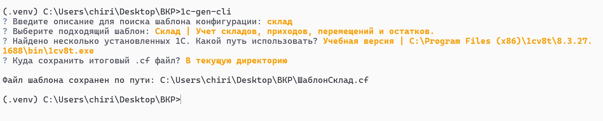
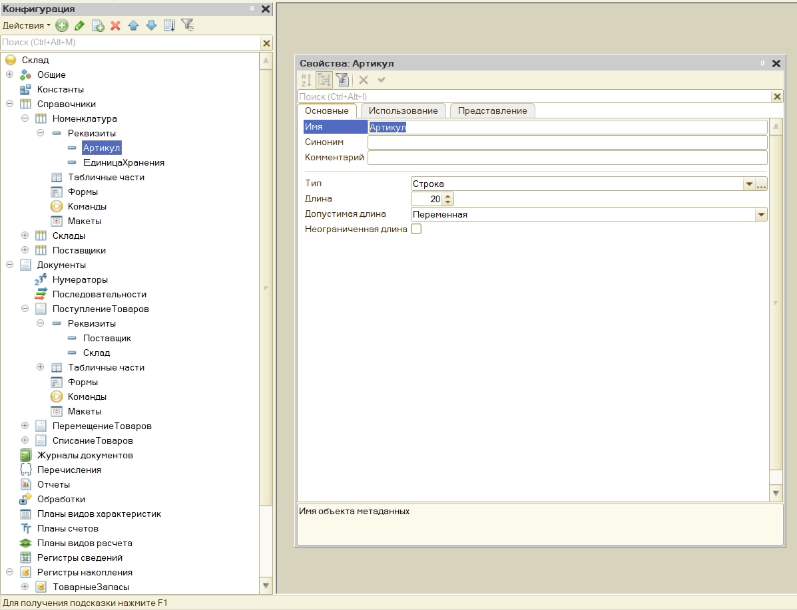

# Запуск проекта

## Создайте и активируйте [виртуальное окружение](https://docs.python.org/3/library/venv.html)

На Linux или MacOS:

```bash
python3 -m venv .venv
source .venv/bin/activate
```

На Windows:

```bash
py -m venv .venv
.venv\scripts\activate
```

Если вы используете [uv](https://github.com/astral-sh/uv):

```bash
uv venv .venv --seed
.venv\scripts\activate
```

## Установка зависимостей проекта

Используя pip:

```bash
pip install .
```

Используя [uv](https://github.com/astral-sh/uv):

```bash
uv pip install .
```

## Запуск проекта

```bash
1c-gen-cli                                                                                                                       
```

### Скриншоты работы проекта

#### Пример работы cli



#### Сгенерированный .cf файл открытый в 1C:Предприятие 8.3


